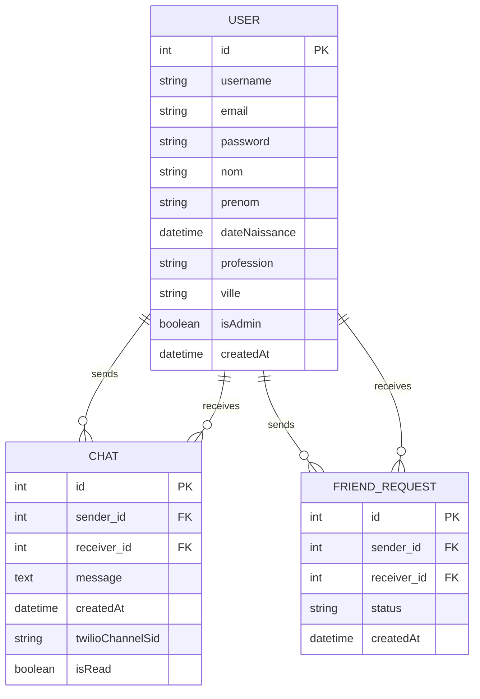
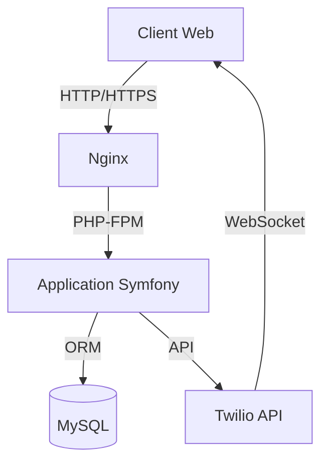
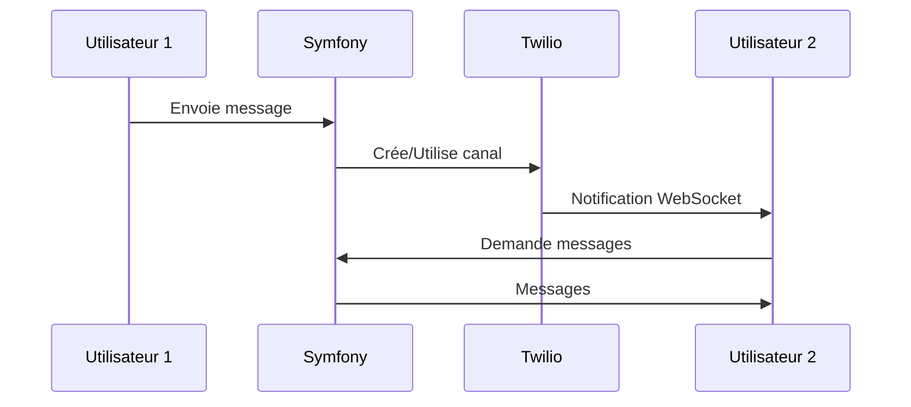

# Documentation Technique - HyperChat

## Table des matières
1. [Architecture du projet](#architecture-du-projet)
2. [Modèle de données](#modèle-de-données)
3. [Schémas d'architecture](#schémas-darchitecture)
4. [Déploiement](#déploiement)
5. [Maintenance](#maintenance)

## Architecture du projet

### Structure des dossiers
```
HyperChat/
├── config/                 # Configuration Symfony
│   ├── packages/          # Configuration des bundles
│   ├── routes/            # Définition des routes
│   └── services.yaml      # Configuration des services
├── migrations/            # Migrations de base de données
├── public/               # Point d'entrée public
│   ├── index.php        # Point d'entrée principal
│   └── assets/          # Assets statiques
├── src/                  # Code source PHP
│   ├── Controller/      # Contrôleurs
│   │   ├── ChatController.php
│   │   ├── HomeController.php
│   │   └── SecurityController.php
│   ├── Entity/         # Entités Doctrine
│   │   ├── Chat.php
│   │   ├── User.php
│   │   └── FriendRequest.php
│   ├── Repository/     # Repositories
│   │   ├── ChatRepository.php
│   │   └── UserRepository.php
│   └── Service/        # Services
│       └── TwilioService.php
├── templates/           # Templates Twig
│   ├── base.html.twig
│   ├── chat/
│   └── home/
├── .env                 # Variables d'environnement
├── docker-compose.yml   # Configuration Docker
└── README.md           # Documentation
```

### Organisation du code

#### Contrôleurs
- `ChatController` : Gestion des conversations et messages
- `HomeController` : Page d'accueil et gestion des amis
- `SecurityController` : Authentification et gestion des utilisateurs

#### Services
- `TwilioService` : Intégration avec l'API Twilio pour la messagerie en temps réel

## Modèle de données

### Diagramme ER


### Description des entités

#### User
- **id** : Identifiant unique
- **username** : Nom d'utilisateur
- **email** : Adresse email
- **password** : Mot de passe hashé
- **nom** : Nom de famille
- **prenom** : Prénom
- **dateNaissance** : Date de naissance
- **profession** : Profession (optionnel)
- **ville** : Ville de résidence (optionnel)
- **isAdmin** : Statut administrateur
- **createdAt** : Date de création du compte

#### Chat
- **id** : Identifiant unique
- **sender** : Utilisateur expéditeur
- **receiver** : Utilisateur destinataire
- **message** : Contenu du message
- **createdAt** : Date d'envoi
- **twilioChannelSid** : Identifiant du canal Twilio
- **isRead** : Statut de lecture

#### FriendRequest
- **id** : Identifiant unique
- **sender** : Utilisateur demandeur
- **receiver** : Utilisateur destinataire
- **status** : Statut de la demande (pending/accepted/rejected)
- **createdAt** : Date de la demande

## Schémas d'architecture

### Architecture globale


### Flux de messagerie


## Déploiement

### Environnements
1. **Développement**
   - Docker local
   - Base de données locale
   - Twilio Sandbox

2. **Production**
   - Serveur dédié/VPS
   - Base de données dédiée
   - Twilio Production

### Étapes de déploiement

1. **Préparation du serveur**
   ```bash
   # Installation des dépendances système
   apt-get update
   apt-get install -y nginx mysql-server php8.2-fpm
   ```

2. **Configuration Nginx**
   ```nginx
   server {
       listen 80;
       server_name hyperchat.example.com;
       root /var/www/hyperchat/public;

       location / {
           try_files $uri /index.php$is_args$args;
       }

       location ~ ^/index\.php(/|$) {
           fastcgi_pass unix:/var/run/php/php8.2-fpm.sock;
           fastcgi_split_path_info ^(.+\.php)(/.*)$;
           include fastcgi_params;
       }
   }
   ```

3. **Déploiement de l'application**
   ```bash
   # Cloner le repository
   git clone [REPO_URL] /var/www/hyperchat

   # Installer les dépendances
   composer install --no-dev --optimize-autoloader

   # Configurer les permissions
   chown -R www-data:www-data /var/www/hyperchat
   chmod -R 755 /var/www/hyperchat/var

   # Configurer la base de données
   php bin/console doctrine:migrations:migrate
   ```

4. **Configuration SSL**
   ```bash
   # Installation de Certbot
   apt-get install certbot python3-certbot-nginx

   # Obtention du certificat
   certbot --nginx -d hyperchat.example.com
   ```

## Maintenance

### Sauvegarde
```bash
# Sauvegarde de la base de données
mysqldump -u root -p hyperchat > backup_$(date +%Y%m%d).sql

# Sauvegarde des fichiers
tar -czf hyperchat_$(date +%Y%m%d).tar.gz /var/www/hyperchat
```

### Surveillance
- Monitoring des logs Nginx
- Surveillance de l'utilisation CPU/Mémoire
- Alertes sur les erreurs PHP
- Monitoring des canaux Twilio

### Mises à jour
1. Sauvegarder la base de données
2. Mettre à jour le code source
3. Exécuter les migrations
4. Vider le cache
5. Tester les fonctionnalités critiques

### Logs
- Logs Nginx : `/var/log/nginx/`
- Logs PHP : `/var/log/php8.2-fpm.log`
- Logs Symfony : `var/log/`
- Logs Twilio : Dashboard Twilio 